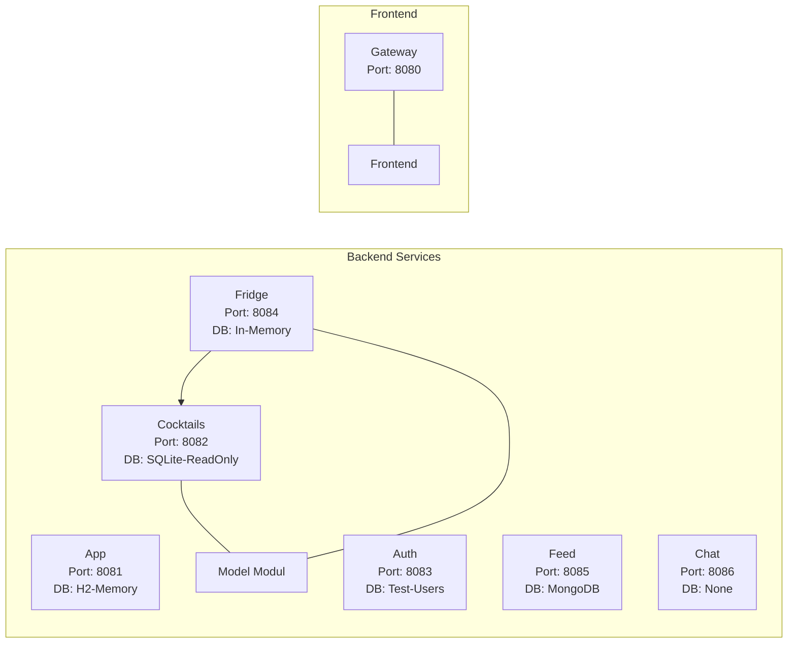

```mermaid
graph LR
    subgraph Backend Services
        APP[App\nPort: 8081\nDB: H2-Memory]
        COK[Cocktails\nPort: 8082\nDB: SQLite-ReadOnly]
        AUTH[Auth\nPort: 8083\nDB: Test-Users]
        FRIDGE[Fridge\nPort: 8084\nDB: In-Memory]
        FEED[Feed\nPort: 8085\nDB: MongoDB]
        CHAT[Chat\nPort: 8086\nDB: None]
        MODEL[Model Modul]
    end
    
    subgraph Frontend
        GW[Gateway\nPort: 8080]
        FE[Frontend]
    end

    %% Abhängigkeiten im Frontend
    GW --- FE

    %% Abhängigkeiten zum Model-Modul
    COK --- MODEL
    FRIDGE --- MODEL

    %% Verbindungen über den Gateway
%%    GW --> APP
%%    GW --> COK
%%    GW --> AUTH
%%    GW --> FRIDGE
%%    GW --> FEED
%%    GW --> CHAT

    %% Fridge ruft Cocktails-Service auf
    FRIDGE --> COK
```
